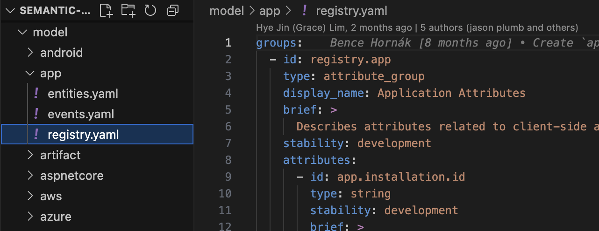

# Semantic convention groups

Spans, metrics, events, and resources are defined in semantic convention groups in YAML schema. Each group has a type property that could be one of the following:

- span - defines semantic convention for a specific type of span, such as HTTP CLIENT
- metric - defines semantic convention for a specific metric, such as HTTP client request duration
- event - defines semantic conventions for a specific event, such as exception.
- entity - defines semantic conventions for a specific entity the telemetry is collected within, such as service.

I've also seen type = "attribute_group", which simply groups attributes. It would be like defining a "namespace" for attributes. For example: sage.product


# Directory Structure 
The image shows something very important: the model folder contains many subdirectories, each representing a group of semantic conventions. Within each subdirectory, there are YAML files that define the specific conventions for that group.



Note that in registry.yaml, the id attribute always has this format:

`- id: registry.<directory-name>`

where <directory-name> is the name of the subdirectory within model. For example, for model/app there is:

`- id: registry.app`

`IMPORTANT: Before making up any new names for attributes (specially) search first in all the models to see if they already exist. Reusing existing attributes is very important for consistency across different systems and tools.`

## **ENTITIES**

### What are they?
**Entities** represent **"things"** or **physical/logical objects** that exist in your system persistently. They are the **main actors** of your infrastructure.

### Characteristics:
- **Type**: `type: entity`
- **Persistence**: They have a lasting existence
- **Identification**: They define `identifying` and `descriptive` attributes
- **Roles**: Attributes have specific roles:
  - `identifying`: To uniquely identify the entity
  - `descriptive`: To describe properties of the entity

### Examples:
```yaml
# An application
- id: entity.app
  type: entity
  name: app
  
# A service
- id: entity.service
  type: entity
  name: service
  
# A Kubernetes pod
- id: entity.k8s.pod
  type: entity
  name: k8s.pod
```

## **EVENTS**

### What are they?
**Events** represent **instantaneous actions** or **occurrences** that happen at a specific moment in time.

### Characteristics:
- **Type**: `type: event`
- **Temporality**: They occur at a specific instant
- **Action**: They describe "something that happened"
- **Attributes**: They contextualize the event with relevant information

### Examples:
```yaml
# A screen click
- id: event.app.screen.click
  type: event
  name: app.screen.click
  
# A widget click
- id: event.app.widget.click
  type: event
  name: app.widget.click
```

## **Key Differences**

| Aspect | **Entities** | **Events** |
|---------|-------------|------------|
| **Concept** | "Things that exist" | "Things that happen" |
| **Duration** | Persistent | Instantaneous |
| **Purpose** | Identify system actors | Record actions/occurrences |
| **Attributes** | Have roles (`identifying`/`descriptive`) | No roles, just context |
| **Example** | A server, an app, a user | A click, an error, a transaction |

## **Relationship between both**

Entities and events are related: **events usually occur IN or BY entities**:

```yaml
# ENTITY: An app
entity.app:
  - app.installation.id: "abc123"
  - app.build_id: "1.2.3"

# EVENT: A click in that app
event.app.screen.click:
  - app.screen.coordinate.x: 100
  - app.screen.coordinate.y: 200
  - app.screen.id: "main_screen"
```

## **What is this distinction used for?**

1. **Entities**: To model your infrastructure and resources
2. **Events**: To record activity and behavior
3. **Dashboards**: Entities are your "dimensions", events are your "metrics"

Is the difference clear to you? Do you have any specific case you'd like us to analyze?